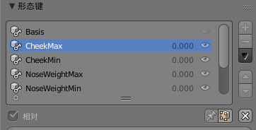
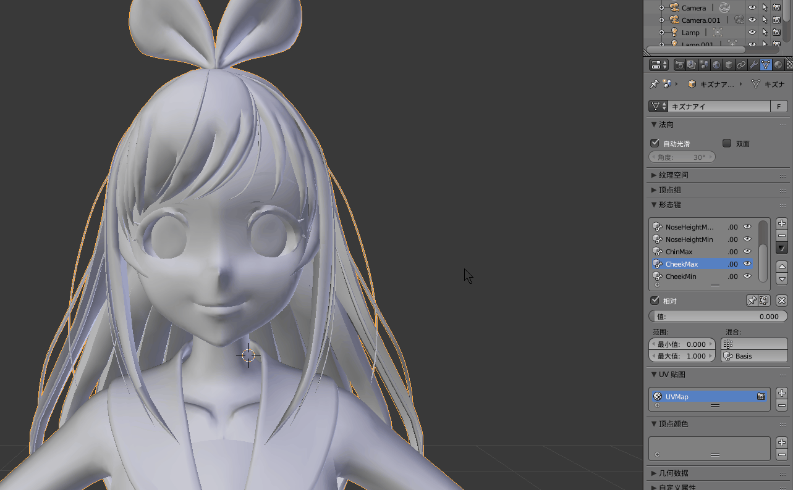
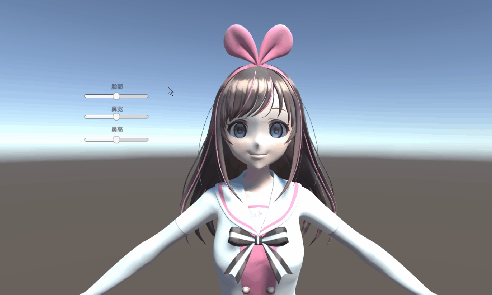

 ---
# WifeCustomization
-------------
模拟捏脸系统.

个性化打造自己的老婆, 本次老婆由VirtualYouTuber绊爱扮演.

相关软件：blender、Unity2018.

可以处理的模型文件格式：OBJ, FBX, 3DS, PLY, STL... 

# Blender:  
- 添加关键形态键

- 设置形态键峰值

# Unity:  

# 原理说明

Blender中设置形态键及相关峰值，Unity中通过BlendShape对模型进行编辑，并编写脚本模拟捏脸.

